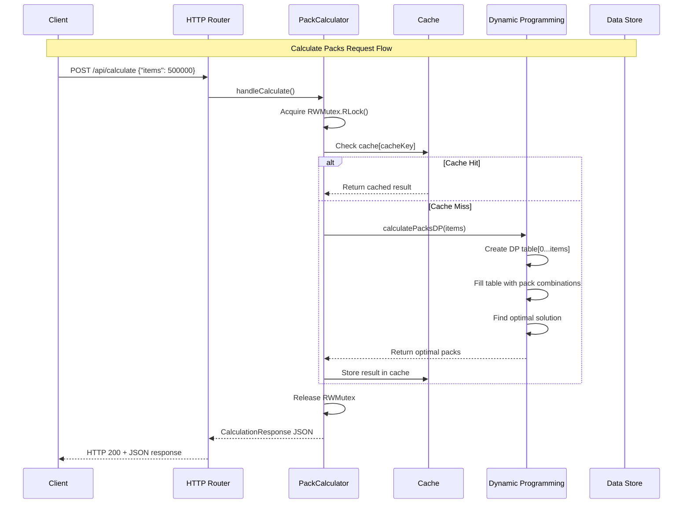
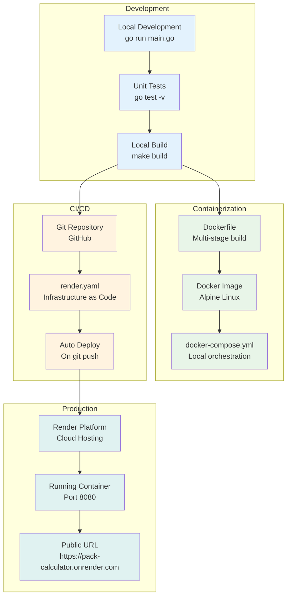

# Order Packs Calculator

A Go-based web service that calculates the optimal number of packs needed to fulfill customer orders.

## Problem Statement

The service solves the pack optimization problem where:
1. Only whole packs can be sent (packs cannot be broken open)
2. Send out the least amount of items to fulfill the order
3. Send out as few packs as possible (within the constraint of rule 2)

## Features

- RESTful API for pack calculation
- Dynamic pack size configuration
- Web UI for easy interaction
- Caching for performance optimization
- Docker support for easy deployment
- Thread-safe operations with comprehensive testing

## System Architecture Diagram
```mermaid
graph TB
    subgraph "Client Layer"
        UI[Web UI<br/>HTML/CSS/JS]
        API_CLIENT[API Client<br/>curl/Postman]
    end

    subgraph "HTTP Layer"
        ROUTER[HTTP Router<br/>Go net/http]
        CORS[CORS Handler<br/>Cross-Origin Support]
    end

    subgraph "API Endpoints"
        GET_PACKS[GET /api/pack-sizes<br/>Get current pack sizes]
        POST_PACKS[POST /api/pack-sizes<br/>Update pack sizes]
        POST_CALC[POST /api/calculate<br/>Calculate optimal packs]
        INDEX[GET /<br/>Serve Web UI]
    end

    subgraph "Business Logic Layer"
        PC[PackCalculator<br/>Main Service]
        MUTEX[sync.RWMutex<br/>Thread Safety]
        CACHE[In-Memory Cache<br/>map[string]*Response]
    end

    subgraph "Algorithm Layer"
        DP[Dynamic Programming<br/>Pack Optimization]
        SORT[Pack Size Sorting<br/>Descending Order]
        VALIDATION[Input Validation<br/>Error Handling]
    end

    subgraph "Data Structures"
        PACK_SIZES[Pack Sizes<br/>[]int]
        DP_TABLE[DP Table<br/>dpEntry Array]
        RESPONSE[CalculationResponse<br/>Packs + Totals]
    end

    subgraph "Infrastructure"
        DOCKER[Docker Container<br/>Alpine Linux]
        RENDER[Render Platform<br/>Cloud Deployment]
        ENV[Environment Variables<br/>PORT, PACK_SIZES]
    end

    %% Client connections
    UI --> ROUTER
    API_CLIENT --> ROUTER

    %% HTTP routing
    ROUTER --> CORS
    CORS --> GET_PACKS
    CORS --> POST_PACKS
    CORS --> POST_CALC
    CORS --> INDEX

    %% API to business logic
    GET_PACKS --> PC
    POST_PACKS --> PC
    POST_CALC --> PC
    INDEX --> UI

    %% Business logic internals
    PC --> MUTEX
    PC --> CACHE
    PC --> DP
    PC --> VALIDATION

    %% Algorithm components
    DP --> DP_TABLE
    DP --> SORT
    SORT --> PACK_SIZES
    VALIDATION --> RESPONSE

    %% Data flow
    PACK_SIZES --> DP
    DP_TABLE --> RESPONSE
    RESPONSE --> CACHE

    %% Infrastructure
    PC --> ENV
    DOCKER --> RENDER
    ENV --> PC

    %% Styling
    classDef clientLayer fill:#e1f5fe
    classDef httpLayer fill:#f3e5f5
    classDef apiLayer fill:#e8f5e8
    classDef businessLayer fill:#fff3e0
    classDef algorithmLayer fill:#fce4ec
    classDef dataLayer fill:#f1f8e9
    classDef infraLayer fill:#e0f2f1

    class UI,API_CLIENT clientLayer
    class ROUTER,CORS httpLayer
    class GET_PACKS,POST_PACKS,POST_CALC,INDEX apiLayer
    class PC,MUTEX,CACHE businessLayer
    class DP,SORT,VALIDATION algorithmLayer
    class PACK_SIZES,DP_TABLE,RESPONSE dataLayer
    class DOCKER,RENDER,ENV infraLayer
```

## Request Flow Diagram


## Data Flow Diagram
```mermaid
flowchart LR
    subgraph "Input Processing"
        INPUT[User Input<br/>Items: 500000]
        VALIDATE[Validation<br/>items > 0]
    end

    subgraph "Cache Layer"
        CACHE_KEY[Cache Key<br/>items_packSizes]
        CACHE_CHECK{Cache Hit?}
        CACHE_STORE[Store Result]
    end

    subgraph "Dynamic Programming"
        DP_INIT[Initialize DP Table<br/>dp[0...maxSize]]
        DP_BASE[Base Case<br/>dp[0] = empty]
        DP_FILL[Fill Table<br/>For each item count]
        DP_OPTIMIZE[Find Optimal<br/>Min items, min packs]
    end

    subgraph "Result Processing"
        RESULT[Pack Distribution<br/>{23:2, 31:7, 53:9429}]
        RESPONSE[JSON Response<br/>totalItems, totalPacks]
    end

    INPUT --> VALIDATE
    VALIDATE --> CACHE_KEY
    CACHE_KEY --> CACHE_CHECK
    
    CACHE_CHECK -->|Hit| RESULT
    CACHE_CHECK -->|Miss| DP_INIT
    
    DP_INIT --> DP_BASE
    DP_BASE --> DP_FILL
    DP_FILL --> DP_OPTIMIZE
    DP_OPTIMIZE --> RESULT
    
    RESULT --> CACHE_STORE
    RESULT --> RESPONSE
    
    CACHE_STORE --> RESPONSE
```

## Component Architecture
```mermaid
graph TB
    subgraph "main.go Components"
        MAIN[main()<br/>Entry Point]
        ROUTES[Route Setup<br/>HTTP Handlers]
        SERVER[HTTP Server<br/>:8080]
    end

    subgraph "PackCalculator Service"
        CONSTRUCTOR[NewPackCalculator()<br/>Initialize with defaults]
        METHODS{Core Methods}
        SET_SIZES[SetPackSizes()<br/>Update pack sizes]
        GET_SIZES[GetPackSizes()<br/>Return current sizes]
        CALCULATE[CalculatePacks()<br/>Main algorithm]
    end

    subgraph "HTTP Handlers"
        H_INDEX[handleIndex()<br/>Serve Web UI]
        H_CALC[handleCalculate()<br/>Process calculation]
        H_GET[handleGetPackSizes()<br/>Return pack sizes]
        H_UPDATE[handleUpdatePackSizes()<br/>Update sizes]
    end

    subgraph "Algorithm Core"
        DP_ALGO[Dynamic Programming<br/>Optimal pack calculation]
        CACHE_MGR[Cache Manager<br/>Performance optimization]
        THREAD_SAFE[Thread Safety<br/>sync.RWMutex]
    end

    MAIN --> ROUTES
    ROUTES --> SERVER
    ROUTES --> H_INDEX
    ROUTES --> H_CALC
    ROUTES --> H_GET
    ROUTES --> H_UPDATE

    H_CALC --> CONSTRUCTOR
    H_GET --> CONSTRUCTOR
    H_UPDATE --> CONSTRUCTOR

    CONSTRUCTOR --> METHODS
    METHODS --> SET_SIZES
    METHODS --> GET_SIZES
    METHODS --> CALCULATE

    CALCULATE --> DP_ALGO
    CALCULATE --> CACHE_MGR
    CALCULATE --> THREAD_SAFE

    classDef mainComp fill:#bbdefb
    classDef serviceComp fill:#c8e6c9
    classDef handlerComp fill:#ffcdd2
    classDef algoComp fill:#f8bbd9

    class MAIN,ROUTES,SERVER mainComp
    class CONSTRUCTOR,METHODS,SET_SIZES,GET_SIZES,CALCULATE serviceComp
    class H_INDEX,H_CALC,H_GET,H_UPDATE handlerComp
    class DP_ALGO,CACHE_MGR,THREAD_SAFE algoComp
```

## Deployment Architecture


## Quick Start

### Using Docker (Recommended)

```bash
# Build the Docker image
make docker-build

# Run the container
make docker-run

# Or use docker-compose
docker-compose up
```

The application will be available at `http://localhost:8080`

### Local Development

```bash
# Install dependencies
go mod tidy

# Run tests
make test

# Run the application
make run

# Or directly with Go
go run main.go
```

## API Endpoints

### Calculate Packs
- **POST** `/api/calculate`
- **Body**: `{"items": 263}`
- **Response**: 
```json
{
  "packs": {"250": 1, "500": 1},
  "totalItems": 750,
  "totalPacks": 2
}
```

### Get Pack Sizes
- **GET** `/api/pack-sizes`
- **Response**: `{"packSizes": [5000, 2000, 1000, 500, 250]}`

### Update Pack Sizes
- **POST** `/api/pack-sizes`
- **Body**: `{"packSizes": [250, 500, 1000, 2000, 5000]}`
- **Response**: `{"success": true, "packSizes": [250, 500, 1000, 2000, 5000]}`

## Environment Variables

- `PORT`: Server port (default: 8080)
- `PACK_SIZES`: Comma-separated pack sizes (default: 250,500,1000,2000,5000)

## Testing

Run unit tests:
```bash
make test

# With coverage
make test-coverage
```

### Test Cases Covered
- Basic pack calculations
- Edge cases with large numbers
- Invalid inputs and error handling
- Caching functionality
- HTTP endpoint testing
- Thread safety

## Edge Case Verification

The algorithm correctly handles the specified edge case:
- **Pack Sizes**: [23, 31, 53]
- **Amount**: 500,000
- **Expected Output**: {23: 2, 31: 7, 53: 9429}
- **Total Items**: 500,000 (exact match)
- **Total Packs**: 9,438

## Algorithm

The application uses a **Dynamic Programming** approach to solve the pack optimization problem:

1. **Rule Priority**: Minimize total items first, then minimize number of packs
2. **Optimization**: Caching for repeated calculations
3. **Thread Safety**: Read-write mutex for concurrent access
4. **Performance**: Efficient DP table with early termination

## Architecture

The application features:
- **Dynamic Programming** for optimal pack calculation
- **In-memory caching** for performance optimization
- **Thread-safe operations** with `sync.RWMutex`
- **Clean separation of concerns** between HTTP handlers and business logic
- **Comprehensive error handling** and input validation
- **CORS support** for web UI integration

## Deployment

### Render

1. **Push to GitHub**

2. **Deploy on Render**:
   - Go to [render.com](https://render.com)
   - Connect your GitHub repository
   - Choose "Web Service"
   - Select **Docker** environment
   - Use `render.yaml` configuration
   - Set environment variables if needed

3. **Automatic Deployment**:
   The `render.yaml` file will automatically configure the deployment with:
   - Docker container build
   - Environment variables
   - Health check endpoint
   - Auto-deploy from main/master branch

### Local Testing

```bash
# Test locally
go mod tidy
go test -v
go run main.go

# Test with Docker
make docker-build
make docker-run
```

### Manual Docker Deployment

```bash
# Build and push to Docker Hub
docker build -t yourusername/pack-calculator .
docker push yourusername/pack-calculator

# Run anywhere
docker run -p 8080:8080 yourusername/pack-calculator
```

## Live Demo

**Render URL**: `https://pack-calculator.onrender.com/`

### Test the Edge Case

```bash
# Update pack sizes to edge case values
curl -X POST https://pack-calculator.onrender.com/api/pack-sizes \
  -H "Content-Type: application/json" \
  -d '{"packSizes": [23, 31, 53]}'

# Calculate for 500,000 items
curl -X POST https://pack-calculator.onrender.com/api/calculate \
  -H "Content-Type: application/json" \
  -d '{"items": 500000}'
```

**Expected Response**:
```json
{
  "packs": {"23": 2, "31": 7, "53": 9429},
  "totalItems": 500000,
  "totalPacks": 9438
}
```