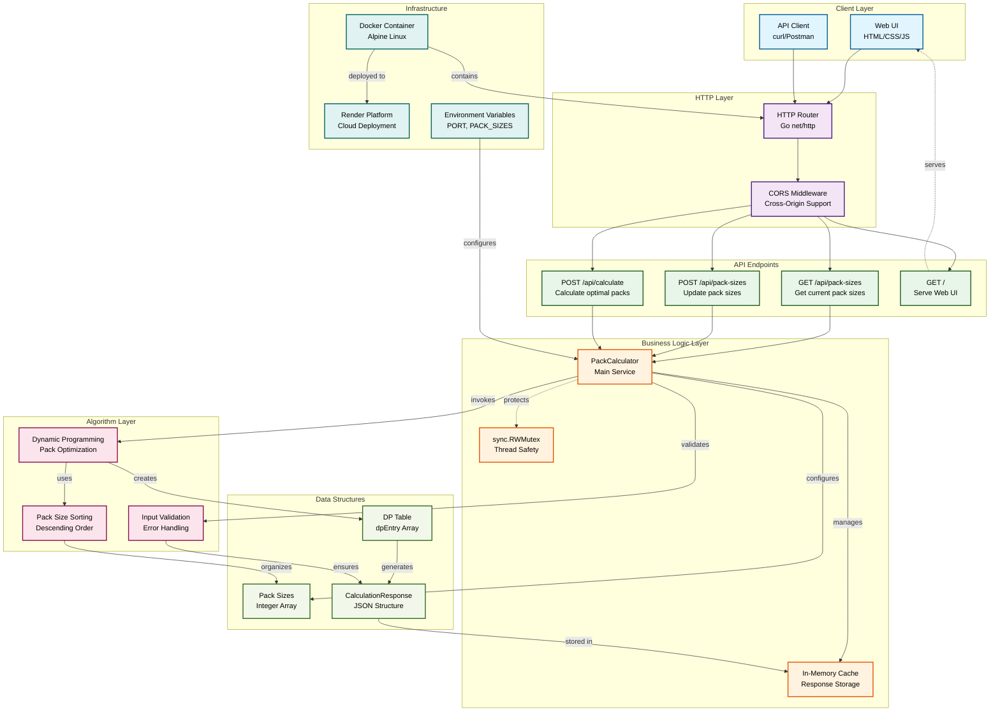

# Order Packs Calculator

A Go-based web service that calculates the optimal number of packs needed to fulfill customer orders.

## Problem Statement

The service solves the pack optimization problem where:
1. Only whole packs can be sent (packs cannot be broken open)
2. Send out the least amount of items to fulfill the order
3. Send out as few packs as possible (within the constraint of rule 2)

## Features

- RESTful API for pack calculation
- Dynamic pack size configuration
- Web UI for easy interaction
- Caching for performance optimization
- Docker support for easy deployment
- Thread-safe operations with comprehensive testing

## System Architecture Diagram


## Quick Start

### Using Docker (Recommended)

```bash
# Build the Docker image
make docker-build

# Run the container
make docker-run

# Or use docker-compose
docker-compose up
```

The application will be available at `http://localhost:8080`

### Local Development

```bash
# Install dependencies
go mod tidy

# Run tests
make test

# Run the application
make run

# Or directly with Go
go run main.go
```

## API Endpoints

### Calculate Packs
- **POST** `/api/calculate`
- **Body**: `{"items": 263}`
- **Response**: 
```json
{
  "packs": {"250": 1, "500": 1},
  "totalItems": 750,
  "totalPacks": 2
}
```

### Get Pack Sizes
- **GET** `/api/pack-sizes`
- **Response**: `{"packSizes": [5000, 2000, 1000, 500, 250]}`

### Update Pack Sizes
- **POST** `/api/pack-sizes`
- **Body**: `{"packSizes": [250, 500, 1000, 2000, 5000]}`
- **Response**: `{"success": true, "packSizes": [250, 500, 1000, 2000, 5000]}`

## Environment Variables

- `PORT`: Server port (default: 8080)
- `PACK_SIZES`: Comma-separated pack sizes (default: 250,500,1000,2000,5000)

## Testing

Run unit tests:
```bash
make test

# With coverage
make test-coverage
```

### Test Cases Covered
- Basic pack calculations
- Edge cases with large numbers
- Invalid inputs and error handling
- Caching functionality
- HTTP endpoint testing
- Thread safety

## Edge Case Verification

The algorithm correctly handles the specified edge case:
- **Pack Sizes**: [23, 31, 53]
- **Amount**: 500,000
- **Expected Output**: {23: 2, 31: 7, 53: 9429}
- **Total Items**: 500,000 (exact match)
- **Total Packs**: 9,438

## Algorithm

The application uses a **Dynamic Programming** approach to solve the pack optimization problem:

1. **Rule Priority**: Minimize total items first, then minimize number of packs
2. **Optimization**: Caching for repeated calculations
3. **Thread Safety**: Read-write mutex for concurrent access
4. **Performance**: Efficient DP table with early termination

## Architecture

The application features:
- **Dynamic Programming** for optimal pack calculation
- **In-memory caching** for performance optimization
- **Thread-safe operations** with `sync.RWMutex`
- **Clean separation of concerns** between HTTP handlers and business logic
- **Comprehensive error handling** and input validation
- **CORS support** for web UI integration

## Deployment

### Render

1. **Push to GitHub**

2. **Deploy on Render**:
   - Go to [render.com](https://render.com)
   - Connect your GitHub repository
   - Choose "Web Service"
   - Select **Docker** environment
   - Use `render.yaml` configuration
   - Set environment variables if needed

3. **Automatic Deployment**:
   The `render.yaml` file will automatically configure the deployment with:
   - Docker container build
   - Environment variables
   - Health check endpoint
   - Auto-deploy from main/master branch

### Local Testing

```bash
# Test locally
go mod tidy
go test -v
go run main.go

# Test with Docker
make docker-build
make docker-run
```

### Manual Docker Deployment

```bash
# Build and push to Docker Hub
docker build -t yourusername/pack-calculator .
docker push yourusername/pack-calculator

# Run anywhere
docker run -p 8080:8080 yourusername/pack-calculator
```

## Live Demo

**Render URL**: `https://pack-calculator.onrender.com/`

### Test the Edge Case

```bash
# Update pack sizes to edge case values
curl -X POST https://pack-calculator.onrender.com/api/pack-sizes \
  -H "Content-Type: application/json" \
  -d '{"packSizes": [23, 31, 53]}'

# Calculate for 500,000 items
curl -X POST https://pack-calculator.onrender.com/api/calculate \
  -H "Content-Type: application/json" \
  -d '{"items": 500000}'
```

**Expected Response**:
```json
{
  "packs": {"23": 2, "31": 7, "53": 9429},
  "totalItems": 500000,
  "totalPacks": 9438
}
```
